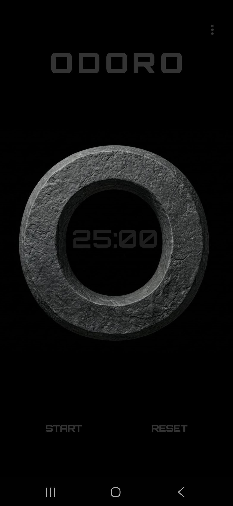
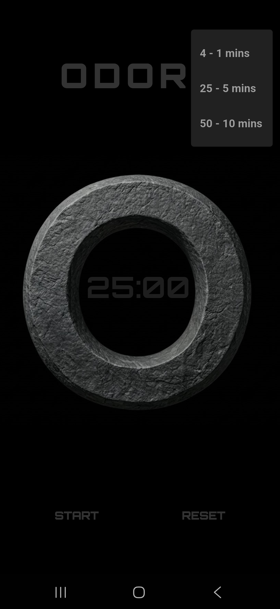

# ⏳ Odoro

Super minimalist Pomodoro android app for deep work sessions.

---

## 📸 Interface Preview

  
  
  
  

---

## 🚀 Quick Start (Installation)

You do not need to compile the source code to run Odoro. You can download and install the latest stable build instantly on your mobile device:

1. Navigate to this repository's official **[Releases](https://github.com/OmJadhav1905/Odoro/releases/tag/v1.0.0-alpha)** page.
2. Under the **Assets** dropdown, click on `odoro.apk` to download the installer package.
3. Open the downloaded file on your Android device and confirm the installation.